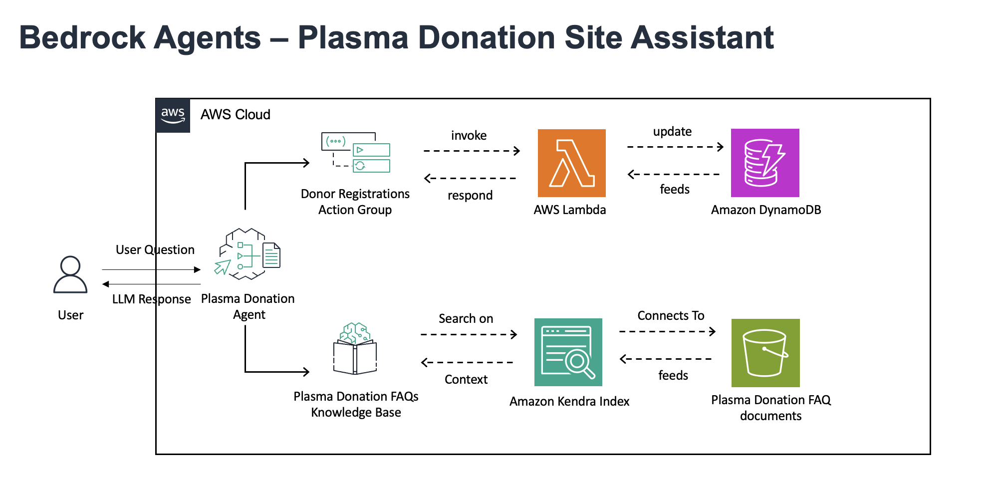

# Bedrock Agents – Plasma Donation Assistant  

## Overview  
The **Plasma Donation Assistant** is an AI-powered virtual assistant built using **Amazon Bedrock Agents**. It helps streamline plasma donation by assisting potential donors with FAQs, guiding them through the registration process, and ensuring they have the right information before donating.  

This project leverages **Amazon Kendra** for intelligent document retrieval, **AWS Lambda** for backend processing, and **Amazon DynamoDB** for managing donor registration data, providing a seamless and scalable solution.  

## Why Amazon Bedrock Agents?  

### **Background**  
Traditional chatbot solutions often require **manual intent mapping**, **complex API integrations**, and **constant retraining** to handle evolving user queries. **Amazon Bedrock Agents** provide a **serverless, scalable, and fully managed AI orchestration layer** that simplifies the process of building intelligent assistants.  

### **Key Advantages of Bedrock Agents**  
**No Manual Prompt Engineering** – Bedrock Agents autonomously **break down user requests into subtasks**, reducing the need for predefined intents.  
**Multi-Step Task Execution** – They handle **complex workflows** such as donor registration, document retrieval, and scheduling.  
**Integration with AWS Services** – Bedrock Agents **seamlessly interact** with **Amazon Kendra, Lambda, and DynamoDB**, making them ideal for enterprise applications.  
**Secure and Compliant** – With **AWS security and compliance standards**, Bedrock ensures **data privacy** in regulated industries like healthcare and pharmaceuticals.  

## Why a Plasma Donation Assistant?  

### **The Problem**  
Pharmaceutical companies rely on **plasma-derived therapies** to treat **immune disorders, hemophilia, and other critical conditions**. However, they face challenges such as:  
- **Donor shortages** due to **lack of awareness** and **misconceptions about plasma donation**.  
- **High dropout rates** because donors are **unsure about the process** or **uncertain about eligibility**.  
- **Inefficient support systems** that rely on call centers, **causing long wait times** for donor inquiries.  

### **The Solution**  
The **Plasma Donation Assistant** solves these problems by:  
**Providing Instant Information** – Using **Amazon Kendra**, the assistant retrieves up-to-date answers to common donor questions.  
**Guiding Donors Through Registration** – With **AWS Lambda and DynamoDB**, it helps users **find donation centers**, **check eligibility**, and **sign up**.  
**Reducing Operational Costs** – Automating donor interactions **lowers customer support expenses** for plasma donation centers.  

---

## Architecture  

  

The architecture consists of:  

### **Bedrock Agent (Core AI Component)**  
- Accepts **natural language questions** from users.  
- Uses **LLMs** to generate responses.  
- Routes **complex queries** to external services like **Amazon Kendra** for FAQ lookup or **AWS Lambda** for donor registration.  

### **Knowledge Retrieval (Amazon Kendra & S3)**  
- **Amazon Kendra** searches indexed **plasma donation FAQ documents** stored in **Amazon S3**.  
- This enables the assistant to provide **accurate, context-aware answers** to donor inquiries.  

### **Donor Registration Workflow (AWS Lambda & DynamoDB)**  
- **AWS Lambda** processes user registrations and **updates DynamoDB** with donor details.  
- This enables **seamless tracking of donor sign-ups** and data retrieval.  


##Setup Instructions  

### **Prerequisites**  
Ensure you have:  
- An **AWS Account** with access to **Amazon Bedrock, Kendra, Lambda, and DynamoDB**.  
- **AWS CLI** configured with necessary permissions.  
- **Python 3.x** installed.  

### **Installation**  
1. **Clone the repository**:  
   ```sh
   git clone https://github.com/your-username/plasma-donation-agent.git
   cd plasma-donation-agent

